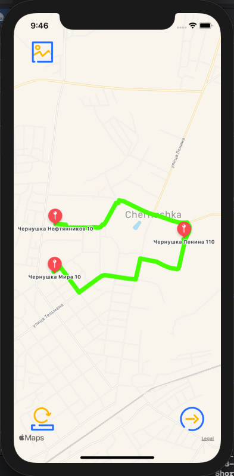
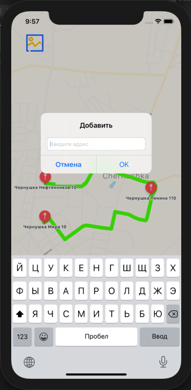

# ShortWay
___
## Оглавление
- **[Описание](#Description)**
- **[Презентация](#Presentation)**

## Описание
Приложение для поиска кратчайшего маршрута между 3-х и более точек на карте.

- Проект написан на **UIKit**
- Верстка интерфейса **Кодом**
- Фрэймворки **MapKit** + **CoreLocation**
___

## Презентация
### Основной экран

### Экран добавления адреса

### Работа приложения

___

